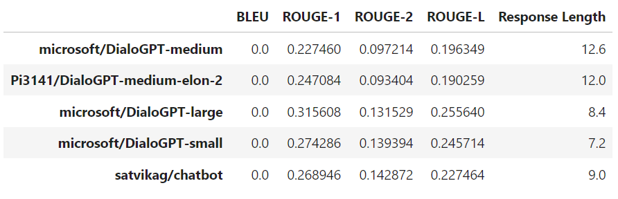
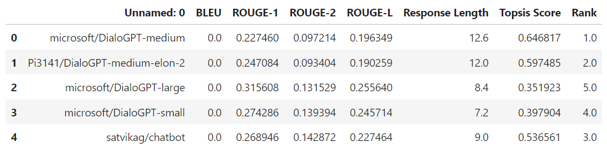
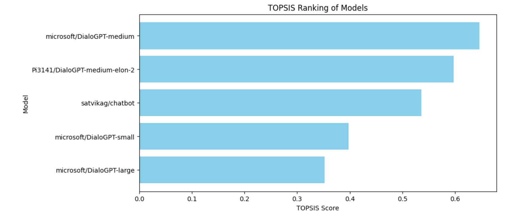

# Topsis-for-Pretained-Models_TextConversational_102217119

Applying topsis to find best Pre-trained Model for Text Conversational
## **1. Methodology**
1. Select 5 pretrained models.
2. Generate reponses to some prompts.
3. Evaluate models on the basis of parameters: BLEU, ROUGE, Reponse Length.
4. Compare the pretrained models by applying Topsis

## **2. Input / Output**

Input

Output

## **3. Evaluation Metrics**
1. BLEU
2. ROUGE Scores
3. Reponse Length

## **4. Models Used**
1. microsoft/DialoGPT-medium
2. Pi3141/DialoGPT-medium-elon-2
3. microsoft/DialoGPT-large
4. microsoft/DialoGPT-small
5. satvikag/chatbot

## **5. Result**

